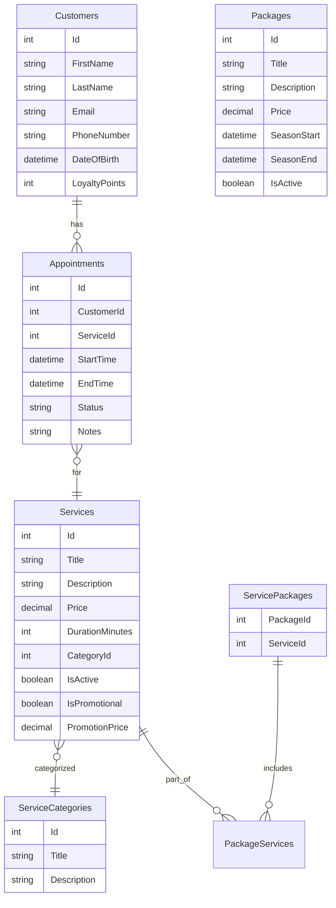

# BeautyManagement

### Entity Relationship Diagram

```mermaid
erDiagram

Customers {
    int Id
    string FirstName
    string LastName
    string Email
    string PhoneNumber
    datetime DateOfBirth
    int LoyaltyPoints
}

Appointments {
    int Id
    int CustomerId
    int ServiceId
    datetime StartTime
    datetime EndTime
    string Status
    string Notes
}

Services {
    int Id
    string Title
    string Description
    decimal Price
    int DurationMinutes
    int CategoryId
    boolean IsActive
    boolean IsPromotional
    decimal PromotionPrice
}

ServiceCategories {
    int Id
    string Title
    string Description
}

Packages {
    int Id
    string Title
    string Description
    decimal Price
    datetime SeasonStart
    datetime SeasonEnd
    boolean IsActive
}

ServicePackages {
    int PackageId
    int ServiceId
}

Customers ||--o{ Appointments : has
Appointments }o--|| Services : for
Services }o--|| ServiceCategories : categorized
ServicePackages ||--o{ PackageServices : includes
Services ||--o{ PackageServices : part_of
```